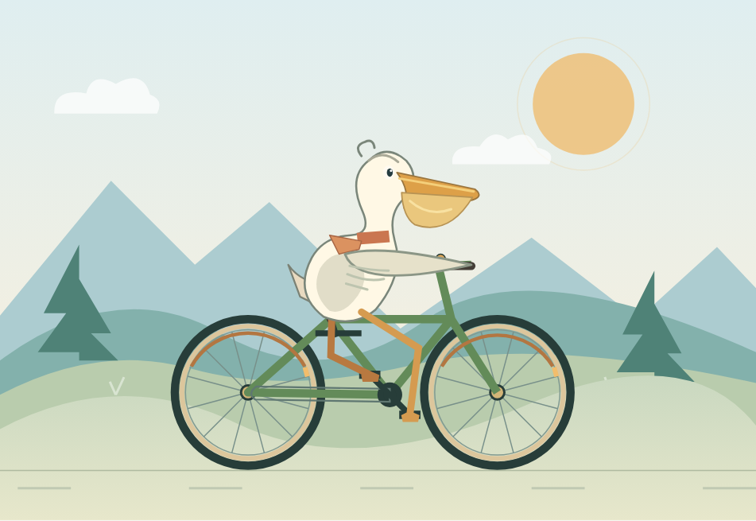
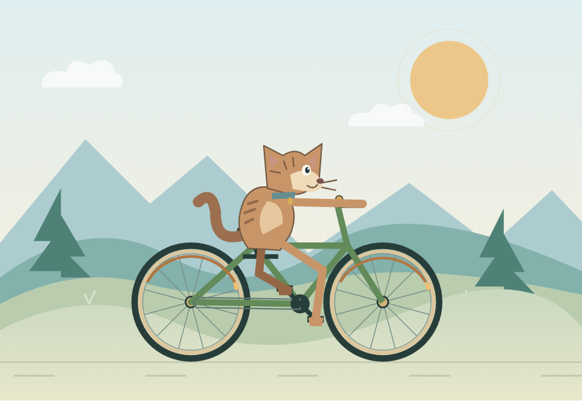
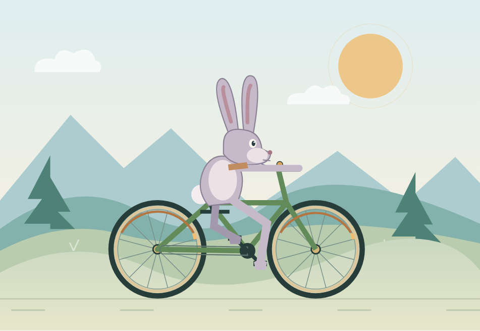
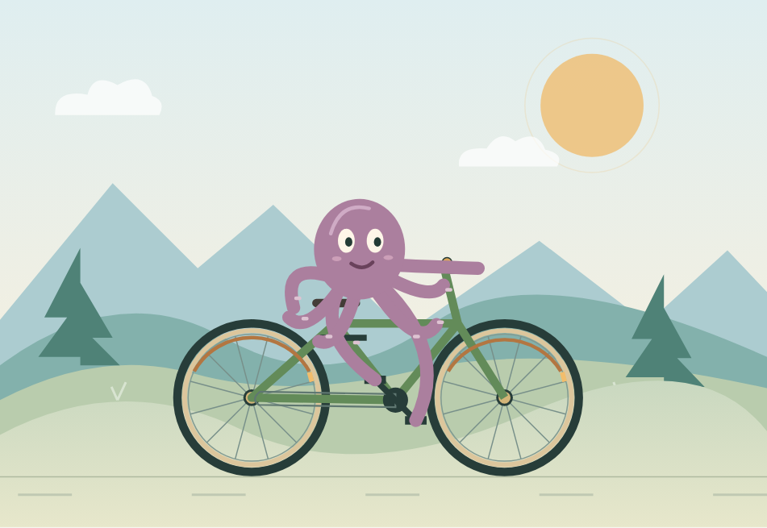

# Test Skill

只输入 `$test-skill`：当前模型生成鹈鹕、猫、章鱼 → 固定程序校验 → 自动打开独立浏览器大窗口。页面直接切换动物、查看结构分和历史。无需选择参数、粘贴代码或打开侧栏。`$test-skill 查看` 只打开已有结果，不消耗生成预算；`$test-skill 章鱼` 只测章鱼。首轮失败保留，不自动修复。

结构跑分 = 通过全部结构检查的动物数 / 测试动物数 × 100，不评判美观或模型身份。历史对比要求相同协议、动物、模型与设置，至少三次有效历史；它提供结构回退线索，不能证明供应商降质。默认快捷测试不强制 Token 预算，严格实验使用下方高级测评。未知模型信息不会猜测。

已安装 Skill 的用户可直接调用；仓库用户先 `npm ci`、`npx playwright install chromium`，将仓库安装为 `test-skill` 技能。浏览器启动脚本支持 Windows、macOS、Linux（后两者尚未实际验证）。Windows 双击 `start-studio.cmd` 重看历史。记录保存在 `~/.codex/test-skill-data`，可通过 `TEST_SKILL_DATA` 指定位置。

v0.3.1：三种动物复用一次浏览器启动，本机相同样例处理耗时中位数 4.49 → 2.17 秒（约减少 52%，不含模型生成）。页面展示程序耗时；查看旧记录无需重新生成。详见 [验证记录](docs/verification.md)。

**How much SVG animation capability can an AI model deliver per token?**

复用自行车和动画骨架，只让模型生成动物。比较输出预算、SVG / JSON 和不同长度的 Skill，保留原始回答、失败记录、真实用量及截图。

| Pelican | Cat | Rabbit | Octopus |
|---|---|---|---|
|  |  |  |  |

*这些是项目自带的手工示例，不是模型测评成绩。Model results: **Not yet benchmarked.***

## 30 秒启动

需要 Node.js 22 或更新版本。Track A 页面不需要安装依赖；独立 HTML 评测与自动测试需要 Playwright。

```sh
node scripts/serve.js
```

打开 http://127.0.0.1:4173 。Windows 可直接双击 `start.cmd`。选择动物、暂停/步进、显示接触点，粘贴模型 SVG 或 JSON 后点击“校验并运行动物”。支持 `?animal=octopus&speed=0.8`。

## 已实现

- 精细 / 极简两套参考，海岸场景、关节踩踏、翼部轮廓。
- 独立技术评分、匿名双作品盲评、四维质量/Token 散点图与 Pareto 前沿。
- 模型指纹：源码 + 画面或截图检索，本地来源样本库、弃权和留一验证。
- 压力测试：单色剪影、仅 Path、12 元素极限。
- 九种动物：鹈鹕、猫、兔、企鹅、青蛙、猴子、长颈鹿、蛇、章鱼。
- 动物与动作解耦；蛇用身体段，章鱼用触手连接车把及踏板。
- Track A 离线测评；Track B 在隔离浏览器中实际运行，生成技术分与四帧证据。
- 50 / 100 / 250 / 500 / 1000 预算，元素上限，None / Micro / Mini / Full Skill。
- 16 相位结构/越界/接触校验，四帧截图，原始回答和 Prompt 哈希。
- 人工质量分与自动合规分开；Token、reasoning、延迟、费用未知时保持 null。
- 可复用 `$test-skill`、离线 provider adapter、结果聚合、自动化测试。

## 新模块怎么用

1. **独立评测**：粘贴完整 HTML 或导入文件，运行后看技术分、错误和四帧证据。按钮可载入手工测试件体验。
2. **匿名盲评**：放入两份同题 SVG/JSON，随机左右位置，填完八项评审才揭晓。
3. **模型指纹**：上传图片或分析当前动物；登记真实来源参考后检索未知作品。没有样本就显示无法判断，绝不预设某种画风属于某模型。
4. **效率对比**：填入四维人工评分和实际总 Token，查看同条件记录的质量/成本关系。

浏览器样本与评分保存在本机 localStorage，可导出 JSON。没有自动调用付费模型、没有预置真实模型库。

[独立评测方法](docs/independent-evaluation.md) · [模型指纹方法与限制](docs/fingerprints.md)

## 安装 Skill

将此完整文件夹复制到 `~/.codex/skills/test-skill/`（Windows 为 `%USERPROFILE%\.codex\skills\test-skill\`）。不要只复制 SKILL.md，它引用了本项目中的协议、例子和运行脚本。刷新技能列表或新开任务后调用：

```text
$test-skill 创建一只章鱼骑自行车，最多 20 个 SVG 元素。
```

当前交付包含技能源码；没有修改你全局安装的技能。

## 跑实验

安装测试依赖（一次）：

```sh
npm ci
npx playwright install chromium
npm test
npm run test:visual
```

生成 360 条 Prompt（18 任务 × 5 预算 × 4 Skill）：

```sh
node scripts/run-benchmark.js --plan work/plan.json
```

把需要测试的条目复制到 `work/manifest.json`，通过模型/API 执行其中的 **完整 prompt**，填入原始回答文件路径、model 和真实 usage。文件路径相对 manifest 所在目录。`prompt` 字段会检查漂移；没有真实模型回答时，不要把示例标成模型成绩。

```json
[
  {
    "task": {"id":"cat-a", "animal":"cat", "track":"A", "budget":500, "maxElements":30},
    "skill":"none",
    "file":"cat-response.svg",
    "model":"your-exact-model-version",
    "provider":"offline",
    "usage":{"inputTokens":null,"outputTokens":null,"reasoningTokens":null,"totalTokens":null,"latencyMs":null,"costUSD":null}
  }
]
```

```sh
node scripts/run-benchmark.js --manifest work/manifest.json --out results/runs/my-run
node scripts/aggregate-results.js results/runs/my-run/results.jsonl
```

默认不调用模型、不花费 API 费用。API 用量来自你导入的实际记录。适配器接口见 [architecture](docs/architecture.md)。结果按模型、provider、track、skill、预算、动物、元素限制分组，避免混算不同难度。

## 测量边界

Token 是成本/计算量的代理，不能直接等同 FLOPs。Track A 的运动由公共骨架提供，不证明模型会自己写动画。自动 PASS 不证明物种辨识、解剖正确或视觉美观。质量需要独立人工评分，详见 [scoring](docs/scoring.md)。当前公开动物都属于开发集，没有伪装成 hidden test。

[实验设计与路线图](docs/benchmark-design.md) · [架构](docs/architecture.md) · [贡献](CONTRIBUTING.md) · [MIT License](LICENSE)

旧 ChatGPT 原型只有链接，未取得附件；此版为重新实现，细节见实验设计文档。GitHub remote 尚未配置，项目尚未推送。
